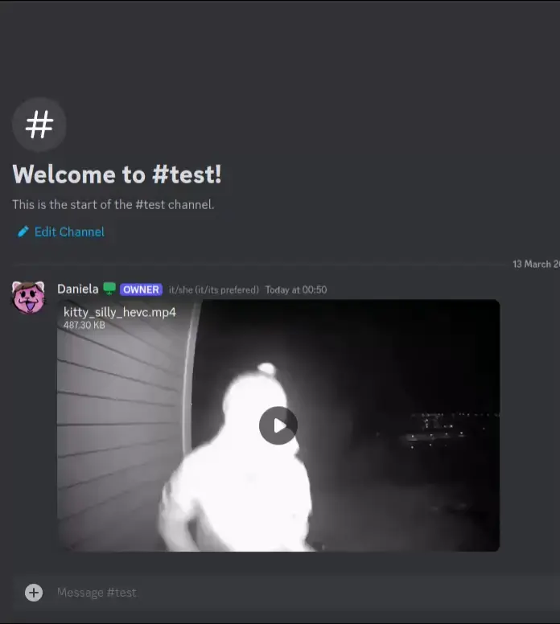

# hevc2h264
A Discord Bot that automatically converts HEVC videos to H264 for better compatibility.



## What's the point?
Yes, I know, the bot instantly sounds pointless and useless, but there is a really good reason why I ended up making this however.

To keep it short, HEVC is a fine codec, but however does not have the best compatibility, especially on Discord.

On Windows, it is a completely mixed bag, with some instances requiring you to purchase a HEVC media extension from the Microsoft Store.

On Linux, it is even worse, with the official Discord Client having absolutely no support for HEVC, making every video posted completely unwatchable, forcing you to download it and watch it in a video player.

If you are also not using a Chromium Browser (aka Firefox or any fork) you are completely out of luck as that does not have any HEVC support either.

Development on this bot started because in a few friend servers I am in, HEVC is becoming a more commonly used format for videos, either because of the smaller file size, or because of whatever video recording software they are using defaulting to it.

This started annoying me and other people in there, as we actively have problems watching the videos posted to the chat, so this bot is basically my bandage solution, and hopefully other people will find it useful as well.

## Self Hosting
This will not go over how to create a bot in the Discord Developer Portal.

Requirements:
- [FFmpeg](https://www.ffmpeg.org/)
- [Node.js](https://nodejs.org/en)
- [discord.js](https://discord.js.org/)

Create a `config.json` file in the root folder that is structured like this (with "TOKEN-GOES-HERE" being replaced by your bots token):
```
{
	"token": "TOKEN-GOES-HERE"
}
```

Run `node .` in the root folder with your terminal to start running the bot.

## Credits
- [famfamfam-silk](https://github.com/legacy-icons/famfamfam-silk) - Icons

## Big thanks to my Ko-fi supporters!
spaceashes<br>
Dionicio3<br>
scotty!<br>
LeaPhant<br>
InvoxiPlayGames<br>

<a href='https://ko-fi.com/G2G1ZERWL' target='_blank'></a>
